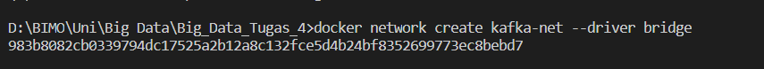
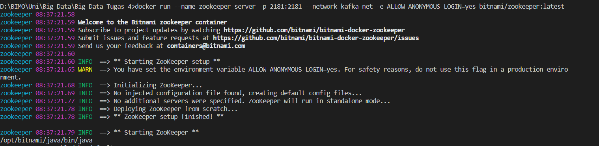
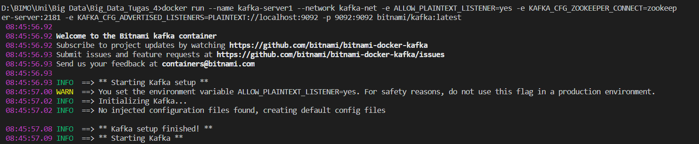
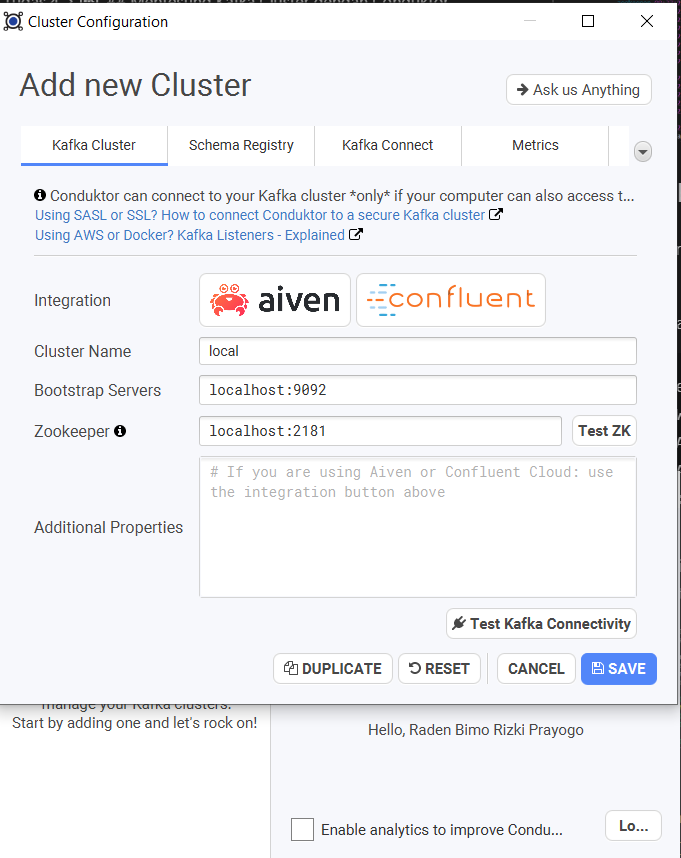
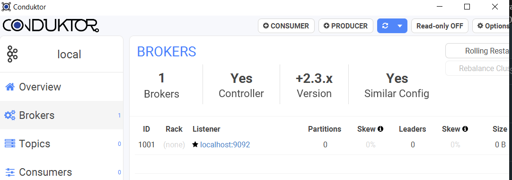
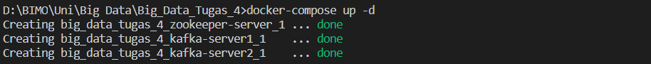
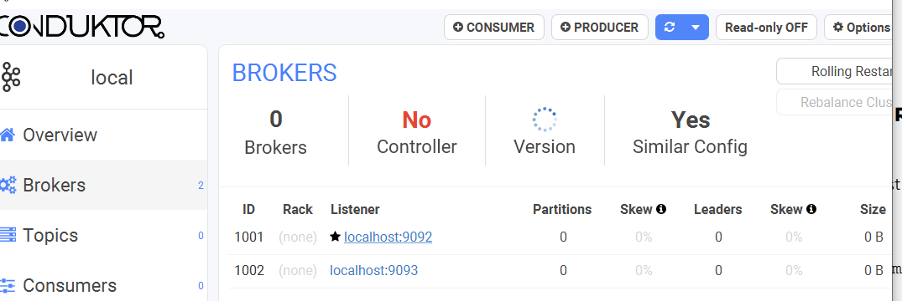

Nama: Raden Bimo Rizki Prayogo

NRP: 0511740000139

# Big Data - Tugas 4

## Membuat Docker network
Kita perlu membuat suatu jaringan yang terhubung dengan bridge. Jaringan tersebut dapat dibuat di docker dengan command :

        docker network create kafka-net --driver bridge

Di sini kita membuat suatu network yang bernama kafka-net.

## Membuat Zookeeper instance
Sebelum membuat Kafka cluster kita, kita perlu membuat suatu Zookeeper instance untuk memanage berbagai Kafka cluster yang akan kita buat. 

Suatu Zookeeper instance tersebut dapat dibuat di docker dengan command :

    docker run --name zookeeper-server -p 2181:2181 --network kafka-net -e ALLOW_ANONYMOUS_LOGIN=yes bitnami/zookeeper:latest

Di sini kita membuat suatu container Zookeeper yang terhubung dengan network kita dengan menggunakan image dari Bitnami. Container tersebut di-port forward ke host/komputer kita dari port 2181 container tersebut ke port 2181 host. Server di-set ALLOW_ANONYMOUS_LOGIN=yes agar kita dapat mengakses aksesnya dengan mudah tanpa login.

## Membuat Kafka instance
Kita membuat Kafka instance yang terhubung dengan Zookeeper yang sudah kita buat.

Suatu Kafka instance tersebut dapat dibuat di docker dengan command :

    docker run --name kafka-server1 --network kafka-net -e ALLOW_PLAINTEXT_LISTENER=yes -e KAFKA_CFG_ZOOKEEPER_CONNECT=zookeeper-server:2181 -e KAFKA_CFG_ADVERTISED_LISTENERS=PLAINTEXT://localhost:9092 -p 9092:9092 bitnami/kafka:latest

Di sini kita membuat suatu insatnce yang terhubung oleh Zookeeper yang sudah kita buat dan terhubung pada port 9092

## Mentesting Kafka Cluster dengan Conduktor

Kita dapat melakukan koneksi dengan kafka cluster kita dengan menggunakan Conduktor. Kita hanya perlu mencantumkan address dari Kafka cluster yang kita buat.

## Membuat Kafka Cluster dan Kafka Zookeeper dengan Docker Compose

Untuk melakukan semua yang sudah kita lakukan sebelumnya dengan Docker Compose, kita hanya perlu membuat suatu file docker-compose.yml yang berisi konfigurasi yang sama dengan yang dicantumkan sebelumnya lalu melakukan docker-compose up dengan. Konfigurasi yang dibuat adalah sebagai berikut:

        version: '2'

        networks:
        kafka-net:
            driver: bridge

        services:
        zookeeper-server:
            image: 'bitnami/zookeeper:latest'
            networks:
            - kafka-net
            ports:
            - '2181:2181'
            environment:
            - ALLOW_ANONYMOUS_LOGIN=yes
        kafka-server1:
            image: 'bitnami/kafka:latest'
            networks:
            - kafka-net    
            ports:
            - '9092:9092'
            environment:
            - KAFKA_CFG_ZOOKEEPER_CONNECT=zookeeper-server:2181
            - KAFKA_CFG_ADVERTISED_LISTENERS=PLAINTEXT://localhost:9092
            - ALLOW_PLAINTEXT_LISTENER=yes
            depends_on:
            - zookeeper-server
        kafka-server2:
            image: 'bitnami/kafka:latest'
            networks:
            - kafka-net    
            ports:
            - '9093:9092'
            environment:
            - KAFKA_CFG_ZOOKEEPER_CONNECT=zookeeper-server:2181
            - KAFKA_CFG_ADVERTISED_LISTENERS=PLAINTEXT://localhost:9093
            - ALLOW_PLAINTEXT_LISTENER=yes
            depends_on:
            - zookeeper-server

